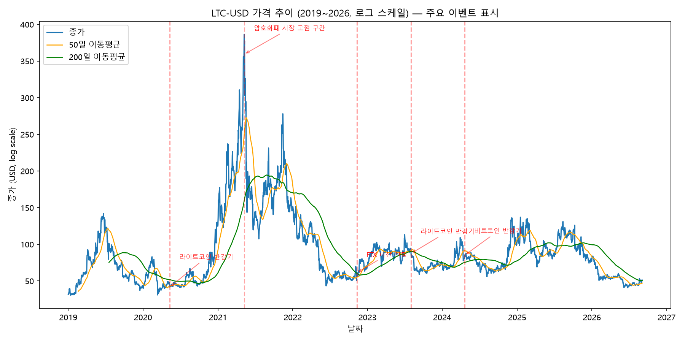
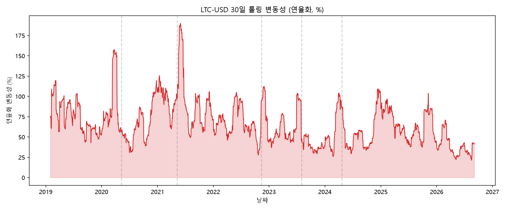
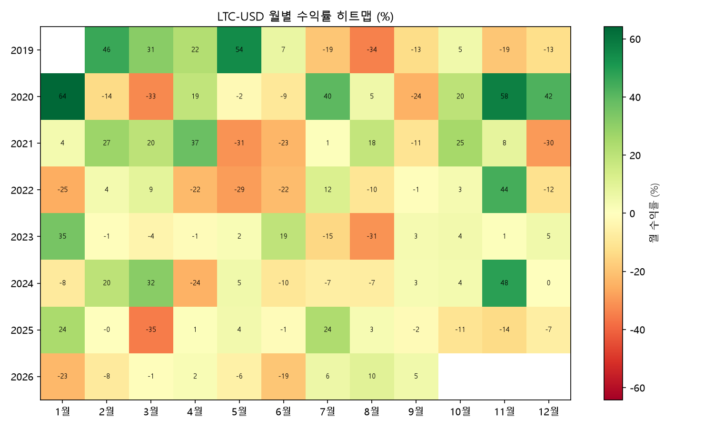
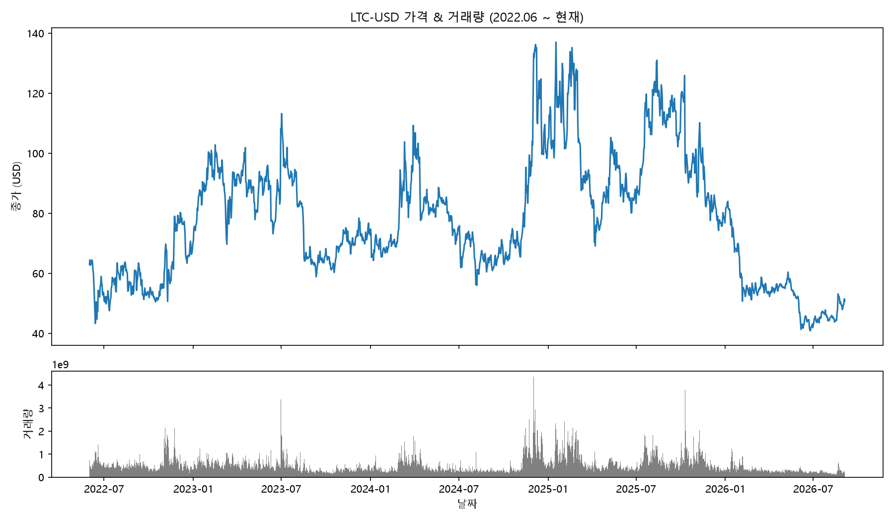

# 라이트코인(LTC-USD) 가격 변동 분석: 반감기와 암호화폐 시장 사이클

## 1. 분석 주제

2019년부터 2026년까지 라이트코인(Litecoin)의 일별 가격과 거래량을 분석한다. 라이트코인 반감기와 암호화폐 시장의 주요 충격이 가격, 변동성, 거래량에 어떤 모습으로 나타났는지 살펴본다.

## 2. 질문

1. 라이트코인 가격은 반감기 전후에 상승 추세로 전환했는가?
2. 가격 상승과 하락은 특정 월에 집중되었는가?
3. 높은 수익 가능성은 어느 정도의 변동성과 낙폭을 동반했는가?
4. 가격 변동이 커지는 시점에 거래량도 함께 증가했는가?

## 3. 데이터 설명

- **출처**: CSV 파일 기반 정적 데이터
- **자산**: Litecoin (LTC-USD), USD 기준 일별 가격
- **기간**: 2019-01-01 ~ 2026-09-04 (일봉 기준)
- **데이터 포인트 수**: 2,804개
- **원본 파일**: [data/litecoin.csv](data/litecoin.csv)
- **컬럼**: Date, Open, High, Low, Close, Volume

## 4. 시각화

### 4.1 가격 추이와 주요 이벤트

로그 스케일에서는 2020~2021년의 급등, 2021년 고점 이후 2022년의 장기 하락, 2023년 반등과 이후 조정이 뚜렷하다. 2020년 5월과 2023년 8월 반감기는 공급 증가율이 낮아진 시점이지만, 가격 방향은 반감기 자체보다 전체 암호화폐 시장의 유동성과 심리에 더 크게 좌우되는 모습이다.

### 4.2 30일 롤링 변동성(연율화)

30일 롤링 변동성의 평균은 연율화 66.4%였다. 급등·급락 국면에서 변동성이 함께 커지므로, 라이트코인은 수익 기회와 손실 위험이 동시에 큰 자산임을 확인할 수 있다.

### 4.3 월별 수익률 히트맵

월별 수익률은 특정 시기에 집중된다. 가장 큰 상승 월은 2020년 1월(+64.2%), 가장 큰 하락 월은 2025년 3월(-35.1%)이었다. 장기 누적 수익률만 보면 놓치기 쉬운 급격한 손실 구간을 함께 확인해야 한다.

### 4.4 가격과 거래량

2022년 중반 이후 가격과 거래량을 함께 보면 급락·반등 구간에서 거래량이 크게 튀는 모습을 확인할 수 있다. 거래량 증가는 방향을 알려주기보다는 시장 참여와 관심이 집중된 구간을 보여주는 보조 신호로 해석하는 것이 적절하다.

## 5. 인사이트

- **반감기만으로 가격 방향을 설명하기 어렵다.** 2020년과 2023년 반감기 전후의 가격 변화는 서로 달랐고, 비트코인 반감기와 거시 유동성 등 더 넓은 시장 요인이 함께 작용했다.
- **가격은 비연속적으로 움직였다.** 월별 히트맵의 큰 상승·하락 값은 장기 평균 수익률이 소수의 강한 달에 좌우될 수 있음을 보여준다.
- **수익과 위험이 함께 컸다.** 분석 기간 누적 수익률은 58.8%였지만, 고점 대비 최대 낙폭(MDD)은 -89.4%였다. 단순 누적 수익률만으로 투자 위험을 판단하면 안 된다.
- **거래량은 확인 신호이지 원인 증명이 아니다.** 거래량 급증은 변동성 확대와 함께 나타날 수 있지만, 거래량만으로 상승 또는 하락의 원인을 확정할 수 없다.

## 6. 결론 및 한계점

### 결론

라이트코인은 분석 기간 동안 누적 58.8% 상승했지만, 중간에 최대 -89.4%의 낙폭을 경험했다. 반감기는 장기 공급 구조를 바꾸는 중요한 이벤트지만 가격의 즉각적인 방향을 보장하지 않았으며, 암호화폐 시장의 유동성·심리·거시 환경과 함께 해석해야 한다. 가장 중요한 결론은 높은 장기 수익 가능성이 극단적인 변동성과 함께 존재한다는 점이다.

### 한계점

- **인과관계 미확인**: 이벤트와 가격 변화를 비교했을 뿐, 반감기가 가격을 발생시켰다고 증명하지 않았다.
- **비교 자산 부족**: 비트코인, 이더리움, 글로벌 유동성 지표와 통제된 비교를 하지 않았다.
- **가격 데이터 한계**: 공개 데이터는 거래소별 편차가 있어 실제 시장 전체를 완전히 대표하지 않을 수 있다.
- **예측 목적 아님**: 과거의 반감기와 변동성 패턴이 미래에도 반복된다는 보장은 없다.

## 7. 코드

- 분석 스크립트: [nvda_analysis.py](nvda_analysis.py)
- 데이터 파일: [data/litecoin.csv](data/litecoin.csv)
- 실행 방법: `python nvda_analysis.py`
